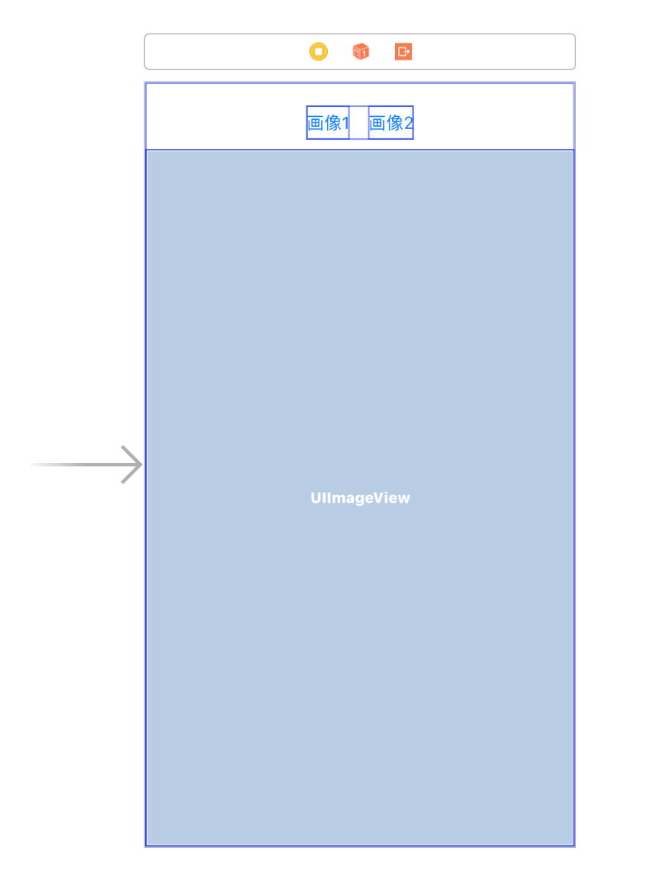
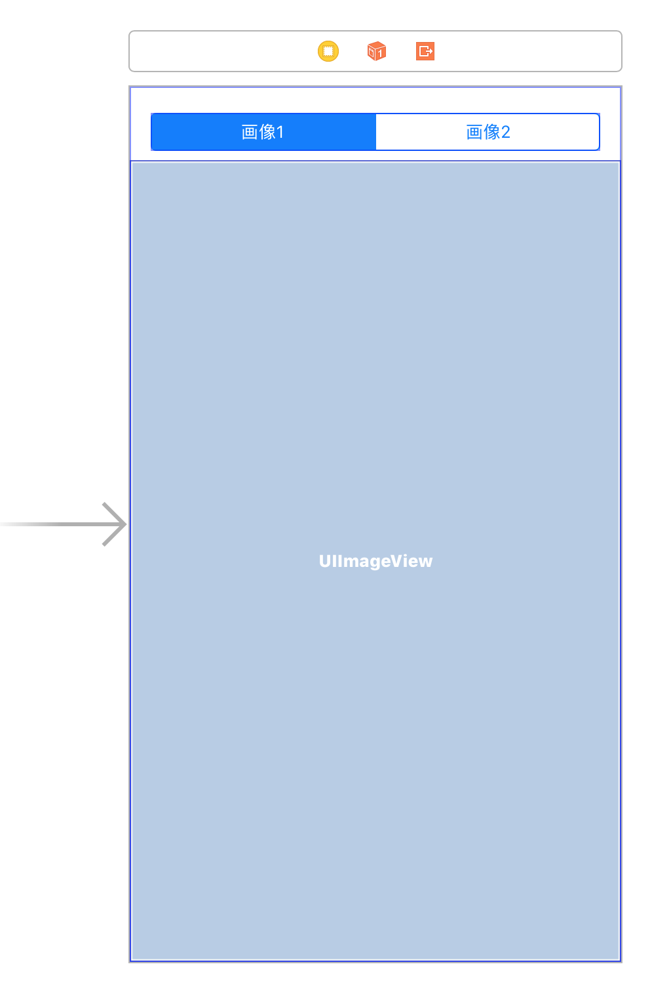

# 画像ビューア的なアプリ
## 要件
- 画像の表示を行う
    - 画像はWebからダウンロードする
        - https://github.com/nhamada/app_dev_tutorial/raw/master/01_DownloadImage/images/image00.jpg
        - https://github.com/nhamada/app_dev_tutorial/raw/master/01_DownloadImage/images/image01.jpg
    - 複数の画像から選択可能
    - 選択された画像を表示する
- サードパーティ製のライブラリ、フレームワークを使ってはいけない

## 最初の実装
### 方針
- 画像`UIImage`の初期化には、[`init?(data:)`](https://developer.apple.com/documentation/uikit/uiimage/1624106-init)を使う。
- 画像データ`Data`は、[`init(contentsOf:options:)`](https://developer.apple.com/documentation/foundation/data/1779617-init)を使う。
- 画像データのあるURLは、アプリ内に直接記述する。
- 画像の選択には、[`UIButton`](https://developer.apple.com/documentation/uikit/uibutton)を使用する。
- 選択された画像は、[`UIImageView`](https://developer.apple.com/documentation/uikit/uiimageview)を使用する。

### 実装
前節の方針を素直に実装すると、以下のようになる。

- [ImageDownload_Initial](ImageDownload_Initial)

#### Storyboard


#### ソースコード
```
import UIKit

class ViewController: UIViewController {

    @IBOutlet weak var buttonForImage1: UIButton!
    @IBOutlet weak var buttonForImage2: UIButton!

    @IBOutlet weak var imageView: UIImageView!

    @IBAction func onButtonForImage1Tapped(_ sender: UIButton) {
        guard let url = URL(string: "https://github.com/nhamada/app_dev_tutorial/raw/master/01_DownloadImage/images/image00.jpg") else {
            return
        }
        do {
            let imageData = try Data(contentsOf: url)
            let image = UIImage(data: imageData)
            imageView.image = image
        } catch (let error){
            NSLog("\(error)")
        }
    }

    @IBAction func onButtonForImage2Tapped(_ sender: UIButton) {
        guard let url = URL(string: "https://github.com/nhamada/app_dev_tutorial/raw/master/01_DownloadImage/images/image01.jpg") else {
            return
        }
        do {
            let imageData = try Data(contentsOf: url)
            let image = UIImage(data: imageData)
            imageView.image = image
        } catch (let error){
            NSLog("\(error)")
        }
    }
}
```

### 問題点
この実装をシミュレーター、または、実機で動作させると分かる問題点を以下に挙げる。

1. 画像が表示されるまで、何も操作ができなくなる。
    - メインスレッドで画像のダウンロードをするため、ダウンロードが終わるまで、操作を受け付けなくなる。
2. 現在、どの画像を表示しているのかが分からない。
    - `UIButton`を使用している、かつ、背景色などを変更する、など行っていないため、内部の状態と、UIの状態の対応がわからない。

また、コードを見たときの問題点は、以下の通りである。

1. `onButtonForImage1Tapped(_:)`と`onButtonForImage2Tapped(_:)`で、同じ処理を行っている。
    - 処理が共通なら、共通メソッドで行った方が変更があった場合に対応しやすい。
2. 画像のURLが、各メソッドで文字列のまま、使用されている。
    - 画像のURLが変更になった場合に、使用箇所を探し、変更するのが大変になりやすい。
        - 他にも同じ画像のURLを使用する場合は、変更漏れが発生しやすい。
3. 全てが`ViewController`で行われている。
    - 1つの場所で複数の役割を持つと、一つの変更が思わぬ影響を発生しやすくなる。
    - チーム開発している場合、変更が衝突しやすくなる。

## 画像の取得方法の変更
最初の実装では、画像のダウンロードをメインスレッドで行なっていた。
そのため、ダウンロードが完了し、画像を表示するまで、アプリの操作が行えなくなる問題があった。
まず、この問題を解決する。

画像のダウンロードし、表示するまでの処理は、以下のようになる。

1. 画像のある`URL`を表すインスタンスを生成。
2. `URL`から、画像のダウンロードを行う。
3. ダウンロードしたデータを、画像(`UIImage`)にする。
4. 画像を`UIImageView`に設定する。

今回、2の画像のダウンロードを、メインスレッドで行わないようにする。
ここで、4の画像を設定する箇所は、UIの更新となるので、メインスレッドで行う必要がある。
1と3の処理は、2と比較し、時間のかかる処理では無いため、どのスレッドで行なっても、特に不都合はない。

メインスレッド以外のスレッドで、何らかの処理を行いたい場合、以下のいずれかの方法で行うのが一般的である。

- [`DispatchQueue`](https://developer.apple.com/documentation/dispatch/dispatchqueue)
- [`OperationQueue`](https://developer.apple.com/documentation/foundation/operationqueue)

今回行なっているような、画像データをWebからダウンロードし表示をする、という場合は、これらを使わず、[`URLSession`](https://developer.apple.com/documentation/foundation/url_loading_system)を使う。
`URLSession`を使う理由は、以下のようになる。

- キャッシュやクッキーなどの扱いを指定する。
- 進捗状況の通知を受ける。
- エラーが発生した場合に、エラーを受け取る。

これら以外にも行えることはあり、詳細は、[URL Loading System](https://developer.apple.com/documentation/foundation/url_loading_system)に記載がある。

`URLSession`の使い方は、以下のようになる。

1. [`URLSessionConfiguration`](https://developer.apple.com/documentation/foundation/urlsessionconfiguration)のインスタンスを生成する。
2. `URLSessionConfiguration`のインスタンスと、デリゲートを指定し、[`URLSession`](https://developer.apple.com/documentation/foundation/urlsession)のインスタンスを生成する。
3. 生成した`URLSession`のインスタンスを使用し、[`URLSessionTask`](https://developer.apple.com/documentation/foundation/urlsessiontask)のサブクラスのタスクのインスタンスを生成する。
4. 生成したタスクのインスタンスの[`resume()`](https://developer.apple.com/documentation/foundation/urlsessiontask/1411121-resume)メソッドを呼び、タスクを開始する。
5. タスクが完了すれば、指定された処理が呼ばれる。
  - タスクのインスタンスを生成する際に指定したクロージャ
  - `URLSession`のインスタンスを生成する際に指定した[`URLSessionDelegate`](https://developer.apple.com/documentation/foundation/urlsessiondelegate)のメソッド

最初の実装を、`URLSession`を使って、書き直したソースコードを次に示す。

### 実装
#### ソースコード
```
import UIKit

class ViewController: UIViewController {

    @IBOutlet weak var buttonForImage1: UIButton!
    @IBOutlet weak var buttonForImage2: UIButton!

    @IBOutlet weak var imageView: UIImageView!

    @IBAction func onButtonForImage1Tapped(_ sender: UIButton) {
        guard let url = URL(string: "https://github.com/nhamada/app_dev_tutorial/raw/master/01_DownloadImage/images/image00.jpg") else {
            return
        }

        let session = URLSession.shared
        let task = session.dataTask(with: url, completionHandler: { [unowned self] (data, response, error) in
            guard let data = data else {
                return
            }
            let image = UIImage(data: data)
            DispatchQueue.main.async { [unowned self] in
                self.imageView.image = image
            }
        })
        task.resume()
    }

    @IBAction func onButtonForImage2Tapped(_ sender: UIButton) {
        guard let url = URL(string: "https://github.com/nhamada/app_dev_tutorial/raw/master/01_DownloadImage/images/image01.jpg") else {
            return
        }

        let session = URLSession.shared
        let task = session.dataTask(with: url, completionHandler: { [unowned self] (data, response, error) in
            guard let data = data else {
                return
            }
            let image = UIImage(data: data)
            DispatchQueue.main.async { [unowned self] in
                self.imageView.image = image
            }
        })
        task.resume()
    }
}
```

### 問題点
今回の実装では、メインスレッドで画像を取得する、という問題点を解決した。
しかし、この解決方法では、以下のような問題がある。

1. 処理のタイミングによっては、選択した画像と異なる画像が表示される。
  - 以下のような処理があり得る。
      1. `画像1`をタップ
      2. `画像1`のダウンロード開始
      3. `画像2`をタップ
      4. `画像2`のダウンロードを開始
      5. `画像2`のダウンロード完了
      6. `画像2`の表示
      7. `画像1`のダウンロード完了
      8. `画像1`の表示
2. 一度表示した画像を、再度表示しようとした時に、再びダウンロードが行われる。
  - すでにダウンロードされている画像なので、この通信は行わなくても良い。

## 表示中の画像の情報表示
ここでの目的は、現在表示している画像を分かるようにすることである。
したがって、方針は、何通りか考えられる。

1. 現在表示している画像に対応するボタンの見た目を、他のボタンの見た目と異なるものにする。
2. ボタンではなく、[`UISegmentedControl`](https://developer.apple.com/documentation/uikit/uisegmentedcontrol)を使用する。
  - 1.と発想は同じであり、実現方法が異なる。
3. ナビゲーションバーを用意し、タイトルとして画像の情報を表示する。

1.の方法では、画像が増えた場合に、ボタンと画像の対応関係を維持し続けるのが、煩雑になる。
画像を一つ追加する場合に、以下のことを行わなければいけない。

- Storyboardにボタンを配置
- `ViewController`に、`Action`を追加
- `Action`から、画像のダウンロードと表示の処理、ボタンの表示の更新処理を記述

一つの変更に対し、三つの変更を加える必要があるため、あまり好ましくない。

2.の方法では、画像を一つ追加した場合、以下のことを行う必要がある。

- Storyboardで、`UISegmentedControl`にセグメントを追加
- `ViewController`の既存の`Action`に画像のダウンロードと表示の処理を記述

1.の方法よりも、変更点が少ないため、こちらの方法の方が好ましい。

ここでは、上記の議論より、画像の選択方法を、`UIButton`から`UISegmentedControl`に変更を行う。
このようにした場合、`UISegmentedControl`の表示状態が、表示している画像を表しているため、3.の方法を用いた画像情報の表示は行わないこととする。
実用を想定した場合であれば、`UISegmentedControl`を使いつつ、ナビゲーションバーにタイトルとして画像の情報を表示する方が、表示している画像の情報がわかりやすくなるので、好ましい。

### 実装
#### Storyboard


#### ソースコード
```
class ViewController: UIViewController {

    @IBOutlet weak var imageView: UIImageView!

    @IBAction func onImageSegmentedControlValueChanged(_ sender: UISegmentedControl) {
        switch sender.selectedSegmentIndex {
        case 0:
            guard let url = URL(string: "https://github.com/nhamada/app_dev_tutorial/raw/master/01_DownloadImage/images/image00.jpg") else {
                return
            }

            let session = URLSession.shared
            let task = session.dataTask(with: url, completionHandler: { [unowned self] (data, response, error) in
                guard let data = data else {
                    return
                }
                let image = UIImage(data: data)
                DispatchQueue.main.async { [unowned self] in
                    self.imageView.image = image
                }
            })
            task.resume()
        case 1:
            guard let url = URL(string: "https://github.com/nhamada/app_dev_tutorial/raw/master/01_DownloadImage/images/image01.jpg") else {
                return
            }

            let session = URLSession.shared
            let task = session.dataTask(with: url, completionHandler: { [unowned self] (data, response, error) in
                guard let data = data else {
                    return
                }
                let image = UIImage(data: data)
                DispatchQueue.main.async { [unowned self] in
                    self.imageView.image = image
                }
            })
            task.resume()
        default:
            fatalError()
        }
    }
}
```

## 画像の取得処理の共通化
現在、画像のダウンロードは`ViewController.onImageSegmentedControlValueChanged(_:)`で行なっている。
画像の取得では、取得元のURLが異なるだけで、以下の処理は同じ処理である。

1. URLからデータのダウンロードを行う。
2. ダウンロードしたデータを画像データにする。
3. 画像データを表示する。

同じ処理を異なる場所に記述していた場合、この処理に変更を加える際に、複数の箇所に同じ変更を加える必要がある。
例えば、ダウンロードを行う前に[`UIActivityIndicatorView`](https://developer.apple.com/documentation/uikit/uiactivityindicatorview)を表示し、ダウンロード完了後に非表示にする、などを行いたい時に、同じ処理を複数の箇所に記述する必要が出てくる。
この時に、同じ処理を複数の場所に記述するため、何らかの誤りを混入する可能性が出てくる。
この時、全てのケースで正しく動作するかの検証も時間がかかるため、可能な限り、同じ処理は一つの場所にまとておいた方が良い。

これらの処理で異なる点は、URLが異なる点である。
したがって、共通化したメソッドは、URLをパラメーターとして受け取り、前述の処理を行う。

### 実装
#### ソースコード
```
class ViewController: UIViewController {

    @IBOutlet weak var imageView: UIImageView!

    @IBAction func onImageSegmentedControlValueChanged(_ sender: UISegmentedControl) {
        switch sender.selectedSegmentIndex {
        case 0:
            guard let url = URL(string: "https://github.com/nhamada/app_dev_tutorial/raw/master/01_DownloadImage/images/image00.jpg") else {
                return
            }
            downloadImage(from: url, into: imageView)
        case 1:
            guard let url = URL(string: "https://github.com/nhamada/app_dev_tutorial/raw/master/01_DownloadImage/images/image01.jpg") else {
                return
            }
            downloadImage(from: url, into: imageView)
        default:
            fatalError()
        }
    }

    private func downloadImage(from url: URL, into imageView: UIImageView) {
        let session = URLSession.shared
        let task = session.dataTask(with: url, completionHandler: { (data, response, error) in
            guard let data = data else {
                return
            }
            let image = UIImage(data: data)
            DispatchQueue.main.async {
                imageView.image = image
            }
        })
        task.resume()
    }
}
```

## コード上での画像の指定方法の変更
現在、画像のURLは、直接、イニシャライザに指定している。
一箇所のみで使用する場合には、このような書き方でも良い。
しかしながら、複数の場所から参照される場合には、このような書き方は避けるべきである。
それは、前節での理由と同様に、変更箇所が複数存在することになり修正箇所が増えるためである。
単純な文字列であれば、問題は少ないが、フォーマット文字列などの場合には、フォーマットが正しいかどうか、など、考慮する点も増える。
そのため、文字列は定数として扱うことが好ましい。

文字列を定数として扱う場合、以下の方法がある。

1. `class`/`struct`に定数として定義する。
2. `enum`を定義し、文字列を返すプロパティを定義する。

今回は、`enum`を定義することとする。
`enum`としておくことで、前節で作成したメソッドに、URLを渡す形式から、ここで定義した`enum`を渡す、ということが実現できる。
（`struct`でも同様のことはできるが、`enum`の方が分かりやすい、という点で、`enum`を選択している）
`enum`では、`UISegmentedControl`の選択されたindexから、適切な画像を返すメソッドも必要となる。
したがって、以下のような`enum`が必要となる。

- 画像に対応した定数
- `index`から、定数を返すメソッド
- `URL`を取得するプロパティ

### 実装
#### ソースコード
```
enum AppImage {
    case image0
    case image1

    init(index: Int) {
        switch index {
        case 0:
            self = .image0
        case 1:
            self = .image1
        default:
            fatalError("Invalid index: \(index)")
        }
    }

    var urlString: String {
        switch self {
        case .image0:
            return "https://github.com/nhamada/app_dev_tutorial/raw/master/01_DownloadImage/images/image00.jpg"
        case .image1:
            return "https://github.com/nhamada/app_dev_tutorial/raw/master/01_DownloadImage/images/image01.jpg"
        }
    }

    var url: URL {
        guard let url = URL(string: urlString) else {
            fatalError()
        }
        return url
    }
}

class ViewController: UIViewController {

    @IBOutlet weak var imageView: UIImageView!

    @IBAction func onImageSegmentedControlValueChanged(_ sender: UISegmentedControl) {
        let image = AppImage(index: sender.selectedSegmentIndex)
        download(image: image, into: imageView)
    }

    private func download(image: AppImage, into imageView: UIImageView) {
        let session = URLSession.shared
        let task = session.dataTask(with: image.url, completionHandler: { (data, response, error) in
            guard let data = data else {
                return
            }
            let image = UIImage(data: data)
            DispatchQueue.main.async {
                imageView.image = image
            }
        })
        task.resume()
    }
}
```

## 機能の分割
ここまで実装してきたソースコードでは、全て、`ViewController`の中で処理を記述してきた。
この方法の利点は、見るべきファイルが1つであるため、規模が小さい間は、実装を把握しやすい、という点である。
しかし、以下のような欠点があるため、可能な限り、機能を分割すべきである。

- 複数人で作業をする場合に、作業内容が衝突する可能性がある。
  - 同じ箇所を複数人が変更しようとする、など。
- 規模が大きくなると、全体像の把握が難しくなる。
  - 全てが一つの場所に書かれているため、見通しが悪くなる。
- 処理が複雑に絡みやすくなり、一つの変更が多くの場所に影響する可能性が高くなる。
  - ある処理のために作成したメソッドを異なる処理で呼んでおり、メソッドの修正が二つの場所に影響する、など。

基本的なアプリの動作を考えたときに、アプリの流れは以下のようになる。

1. ユーザーの操作を受け付け、処理を要求する。
2. 要求を受け取り、何らかの処理を行い、その結果の表示を要求する。
3. 表示要求を受け取り、結果の整形を行い、表示をする。

今回のアプリでは、以下のような構成が考えられる。

| `class` | 役割 |
|:--------|:----|
| `ViewController` | ユーザーの操作を受け取り、処理を要求する。画像を表示をする。|
| `Presenter` | 画像の取得を要求する。画像の表示を要求する。 |
| `ImageService` | 画像の取得を行う。 |

このような構成では、処理の流れは、以下のようになる。

1. ユーザー操作
2. `ViewController`は、ユーザー操作から、`Presenter`に画像の取得を要求する。
3. `Presenter`は、`ImageService`に対し、画像の取得を要求する。
4. 画像の取得後、`ImageService`は、`Presenter`に画像の表示を要求する。
5. `Presenter`は、`ViewController`に画像の表示を要求する。

機能ごとに、分割を行うことで、以下のような利点がある。

- `ViewController`は、画像がどこから取得されるかを考慮しなくて良い。
  - アプリ内に同梱された画像も、Webからダウンロードしてきた画像も、同じように扱える。
  - つまり、`ImageService`の内部実装を変更することで、画像の取得元を変更できる。
- `Presenter`は、画像がどこに表示されるかは考慮しなくて良い。
  - 具体的に表示する`UIImageView`を意識する必要がなくなる。
  - 表示する`UIImageView`が変更されても、`Presenter`は、そのことを意識しなくて良い。
- `Presenter`は、画像の取得要求のユーザー操作がどのように行われたかを知らなくて良い。
  - UIが変更されても、`Presenter`は変更の必要がない。

### 実装
#### ソースコード
##### `ViewController`
```
class ViewController: UIViewController, PresenterOutput {
    // MARK:- Outlets
    @IBOutlet weak var imageView: UIImageView!

    // MARK:- Private properties
    private var presenter: Presenter!

    // MARK:- Lifecycle
    override func viewDidLoad() {
        super.viewDidLoad()

        self.presenter = Presenter(output: self)
    }

    // MARK:- Actions
    @IBAction func onImageSegmentedControlValueChanged(_ sender: UISegmentedControl) {
        let image = AppImage(index: sender.selectedSegmentIndex)
        presenter.request(image: image)
    }

    // MARK:- PresenterOutput
    func show(image: UIImage) {
        imageView.image = image
    }

    func clearImage() {
        imageView.image = nil
    }
}
```

##### `Presenter`
```
protocol PresenterOutput: class {
    func show(image: UIImage)

    func clearImage()
}

final class Presenter {
    private let imageService = ImageService.default

    private weak var output: PresenterOutput?

    init(output: PresenterOutput) {
        self.output = output
    }

    func request(image: AppImage) {
        imageService.request(image: image, completion: { [weak self] (image, error) in
            if let image = image {
                self?.output?.show(image: image)
            }
        })
    }
}
```

##### `ImageService`
```
final class ImageService {
    static let `default` = ImageService(configuration: .default)

    private let session: URLSession
    private var dataTask: URLSessionDataTask? = nil

    init(configuration: URLSessionConfiguration) {
        session = URLSession(configuration: configuration)
    }

    func request(image: AppImage, completion: @escaping (UIImage?, Error?) -> Void) {
        if let dataTask = dataTask {
            dataTask.cancel()
            self.dataTask = nil
        }

        dataTask = session.dataTask(with: image.url, completionHandler: { (data, response, error) in
            guard let data = data else {
                DispatchQueue.main.async {
                    completion(nil, error)
                }
                return
            }
            let image = UIImage(data: data)
            DispatchQueue.main.async {
                completion(image, nil)
            }
        })
        dataTask?.resume()
    }
}
```

##### `AppImage`
```
enum AppImage {
    case image0
    case image1

    init(index: Int) {
        switch index {
        case 0:
            self = .image0
        case 1:
            self = .image1
        default:
            fatalError("Invalid index: \(index)")
        }
    }

    var urlString: String {
        switch self {
        case .image0:
            return "https://github.com/nhamada/app_dev_tutorial/raw/master/01_DownloadImage/images/image00.jpg"
        case .image1:
            return "https://github.com/nhamada/app_dev_tutorial/raw/master/01_DownloadImage/images/image01.jpg"
        }
    }

    var url: URL {
        guard let url = URL(string: urlString) else {
            fatalError()
        }
        return url
    }
}
```
